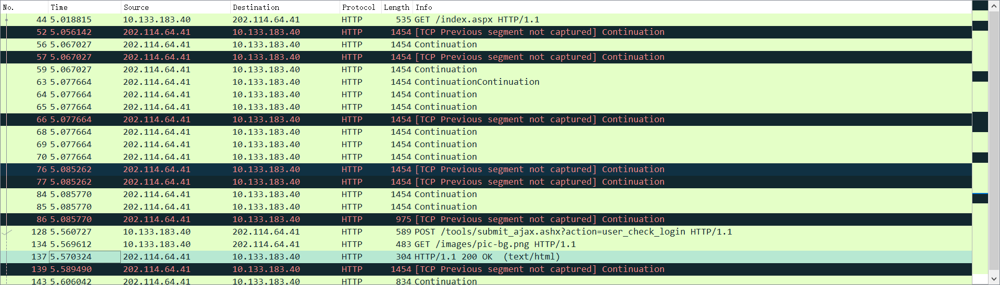
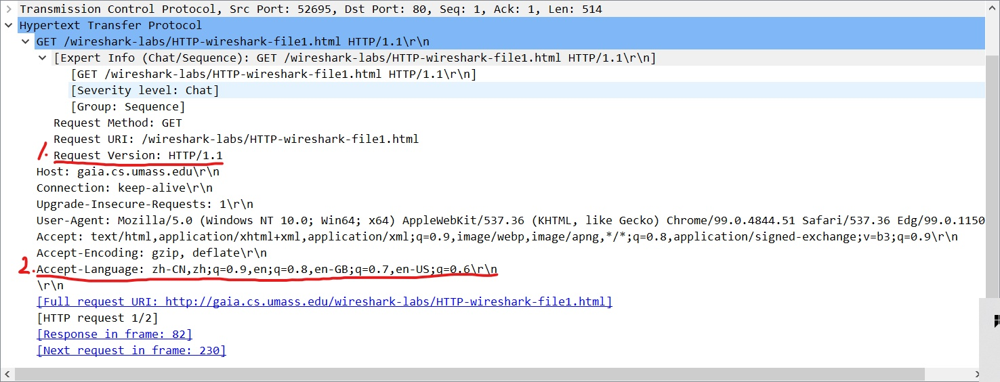
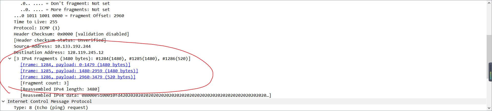

# Lab Report:  

## Ping Another Computer    
### 1.Abstract  
We are supposed to use our own computer to ping another one,and check the results.    
### 2.Introduction   
We are supposed to try using our own computer to ping another one. And in this practical way, we will know something about ping and computer network.  
### 3.Method  
#### Material:  
Two computers  
#### Procedure:  
1. Open my computer's hotspot and make another computer connect it.
2. Check the second computer's IP address.
3. Open my computer's command line and input the ping instruction.
4. check the result if the second comuper receive the data package.  
### 4.Result  
  
The second computer successfully received the package.  
### 5.Conclusion  
By using hotspor to connect two computers, their communication is successful.

## Tracert a Server  
### 1.Abstract  
We are supposed to use our own computer to tracert a server,and check the results.     
### 2.Introduction  
We are supposed to try using our own computer to tracert a server. And in this practical way, we will know something about tracerting and computer network.  
### 3.Method  
#### Material:  
Two computers  
#### Procedure:  
1. Open my computer's hotspot and make another computer connect it.
2. Check the second computer's DNS server.
3. Open my computer's command line and input the tracert instruction.
4. check the result
### 4.Result
  
The result shows the second computer's DNS server is my own computer.It's successful.  
### 5.Conclusion  
By using hotspot to connect two computers, the computer sharing the hotspot is the DNS server of the other one.  

## WireShark Introduction
### 1.Abstract  
We are supposed to learn some basic skills about using WireShark by visiting college website  
### 2.Introduction
We are supposed to learn some basic skills about using WireShark by visiting college website 
### 3.Method
#### Material:
A computer connected with the Internet with a browser and WireShark  
#### Procedure:  
1. Start WireShark. Choose WLAN input and start capturing.
2. Open the browser and in the browser address bar, type http://cs.whu.edu.cn/.
3. After http://cs.whu.edu.cn/index.aspx pages can be rendered by the browser, stop capturing in the WireShark.
4. Check the list of captured packets select the message we need.
### 4.Result
  
   
   
### 5.Conclusion  
1. As shown in Figure One
2. 0.551509s
3. cs.whu.edu.cn's ip:202.114.64.41  
   My ip:10.133.183.40
4. *[GET](wireshark_WLANG6DMI1.pdf )*   
   *[OK](wireshark_WLANG6DMI2 )*   

## Telnet a website
### 1.Abstract  
Telnet two websites  
### 2.Introduct  
We are supposed to telnet websites and sent *GET* message.  
### 3.Method 
#### Material:  
A computer.  
#### Procedure:  
1. Open Powershell and input the instruction `telnet mail.hust.edu.cn 25`  
2. Input the instruction `telnet cs.hust.edu.cn 80`  
3. After we connect the server, input the instruction  
   `GET /index.htm HTTP/1.1`  
   `host:cs.hust.edu.cn`  
### 4.Result  
  
  
### 5.Conclusion  
If we connect a server successfully via telnet instruction, we can sent GET request to the server and get the response.

## Wireshark_HTTP  
### Abstract
Use Wireshark to capture the packages while communicating via http, and get the information.  
### Introduction  
We capture the http packages of different types and we find out the details of these transmissions.  
### Method    
#### 1. The Basic HTTP GET/response interaction  
##### Procedure  
1.	Start up your web browser.
2.	Start up the Wireshark packet sniffer, but don’t yet begin packet capture.  Enter “http” (just the letters, not the quotation marks) in the display-filter-specification window and press enter, so that only captured HTTP messages will be displayed later in the packet-listing window.  (We’re only interested in the HTTP protocol here, and declutter all other uninteresting captured packets). 
3.	Wait a bit more than one minute (we’ll see why shortly), and then begin Wireshark packet capture.
4.	Surf website http://gaia.cs.umass.edu/wireshark-labs/HTTP-wireshark-file1.html in your browser
5.	Your browser should display a very simple, one-line HTML file.
6.	Stop Wireshark packet capture.
##### Result  
 
 
  
1. Both are HTTP 1.1   
2. zh-CN,zh  
3. my computer: 10.133.157.108  
   gaia.cs.umass.edu server: 128.119.245.12  
4. 200 
5. Sat, 12 Mar 2022 06：59: 01 GMT  
6. 128  
7. No.  
#### 2. The HTTP CONDITIONAL GET/response interaction  
##### Procedure  
•	Start up your web browser, and make sure your browser’s cache is cleared, as discussed above.
•	Start up the Wireshark packet sniffer
•	Enter the following URL into your browser
http://gaia.cs.umass.edu/wireshark-labs/HTTP-wireshark-file2.html
Your browser should display a very simple five-line HTML file. 
•	Quickly enter the same URL into your browser again (or simply select the refresh button on your browser)
•	Stop Wireshark packet capture, and enter “http” in the display-filter-specification window, so that only captured HTTP messages will be displayed later in the packet-listing window.  
##### Result  
  
  
  
  
8. No  
9. Yes. There is content length.  
10. Yes. The time the web page was last modified  
11. 304, Not Modified. No.  
#### 3. Retrieving Long Documents  
##### Procedure  
•	Start up your web browser, and make sure your browser’s cache is cleared, as discussed above.
•	Start up the Wireshark packet sniffer
•	Enter the following URL into your browser
http://gaia.cs.umass.edu/wireshark-labs/HTTP-wireshark-file3.html
Your browser should display the rather lengthy US Bill of Rights.
•	Stop Wireshark packet capture, and enter “http” in the display-filter-specification window, so that only captured HTTP messages will be displayed. 
##### Result  
  
 
  
12.  One  
13.  No.53  
14.  200, OK  
15.  Five
#### 4. HTML Documents with Embedded Objects
##### Procedure  
•	Start up your web browser, and make sure your browser’s cache is cleared, as discussed above.
•	Start up the Wireshark packet sniffer
•	Enter the following URL into your browser
http://gaia.cs.umass.edu/wireshark-labs/HTTP-wireshark-file4.html
Your browser should display a short HTML file with two images. These two images are referenced in the base HTML file.  That is, the images themselves are not contained in the HTML; instead the URLs for the images are contained in the downloaded HTML file. As discussed in the textbook, your browser will have to retrieve these logos from the indicated web sites.   The textbook publisher’s logo is retrieved from the gaia.cs.umass.edu web site.  The image of the cover for the 5th edition of the textbook is stored at the caite.cs.umass.edu server. (These are two different web servers inside cs.umass.edu).
•	Stop Wireshark packet capture, and enter “http” in the display-filter-specification window, so that only captured HTTP messages will be displayed. 
##### Result  
 
16. Three  
17. According to the order of the respones, I guess its serial.  

## Wireshark_DNS  
  
  
  
1. I looked up Baidu, its IP address is 36.152.44.96 and 36.152.44.95  
2. I looked up Oxford University
3. I used dns0.ox.ac.uk to query yahoo but failed, so I retried facebook and succeeded.  
   
  
  
  
  
  
4. UDP  
5. Both are 53  
6. The DNS query message was sent to 202.114.96.1
   Yes, they are the same.
7. Type is A. And it didn't get any answer. 
8. It provided 3 answers. They contained ServerName, Type, Class, Time to live, Date length and Cname.  
9. No, they had no corresponce.  
10. No.
  
        
11. Both are 53.
12. The DNS query message was sent to 202.114.96.1  
   Yes, they are the same.  
13. The type is AAAA. And it got no answer.  
14. Two. They contained ServerName, Type, Class, Time to live, Date length and Cname.  
    
  
16. The DNS query message was sent to 202.114.96.1
   Yes, they are the same.  
17. The type is NS. And it had no answer.  
18. 
 ns7.dnsmadeeasy.com
    ns6.dnsmadeeasy.com  
    ns5.dnsmadeeasy.com  
    atalante.stanford.edu  
    avallone.stanford.edu
    argus.stanford.edu  
    No, it didn't provide.  
  
  
1.  It was sent to 171.64.7.115. They seemed to have no corresponce.  
2.  The type is A. It didn't contain any answer.  
3.  One. They contained ServerName, Type, Class, Time to live, Date length and Cname.  

## Wireshark_UDP    
1. There are 4 fields and they are Source Port, Destination Port, Length and Checksum.   
     
2. There are four header fields and each of them occupies 2 bytes. So, totally, its length is 8 bytes.  
3. It is the length of header fields plus data fields.  
   
4. Length has 2 bytes so it can represent $ 2^{8*2} $ bytes data. And the header occupies 8. So, its maximum number is $ 2^{16}-8 $  
5. The Port also has 2 bytes. And the port number begins with 0. So, the largest is $ 2^{16}-1 $  
6. As the picture above shows, its 17. And Hexadecimally, it's 0X11  
7. Their Source Port is corresponding with the other Destination Port.  
## Wireshark_TCP  
1. source IP:10.133.192.244 prort:52592
2. gaia.cs.umass.edu IP: 128.199.245.12 port:80
3. the same as the question 1
   
4. seq=0, using [SYN]
5. seq=0, ACK=1, the seq of syn +1, using [SYN,ACK]
   
6. seq=43201
7. |number|1|2|3|4|5|6|
   |---|---|---|---|---|---|---|
   |seq|1|1441|2881|4321|4761|7201|
   |send time|3.715887|same|same|same|   4.032636|same|
   |receive time|4.032541|same|same|same|4.350989|same|
   |rtt|0.316654||||0.318353||
   |EstimatedRTT(a=0.125)|0.316654||||0.316866|0.317052|
   
8. all of them are 1440.
9. 32128
 yes,the content surpass its size will be dropped.
     
10. No. I check the time sequece graphs(strevens). Its sequece number never became smaller.  
     
11. almost all of them are 1440.
    if each sequence number has a related ack number, then all of the segments are acknowleged.  
12. $avg(throughput)=149505\div(2.566962)=56.876kb/s$
     
13. 
        
## Wireshark_IP 
    
2. ICMP  
3. There are 20 bytes in the packet header. Because there are totally 56 bytes, the packet's payload is 36 bytes.  
4. No, there are no packets that their ttl is the same.  
    
5. ttl,header checksum and identification are always changing. 
6.  must stay contant:
   * **Version**: The versions used by the communication parties must be the same  
   * **Header Length**: it is determined by ipv4 protocol.  
  
 stay constant:  
  * **Datagram length**: This is the total length of the IP datagram (header plus data), measured in bytes. 
  * **source address**
  * **destination address**
  * **Options**: The options fields allow an IP header to be extended. 
  * **Identifier, flags, fragmentation offset**: These three fields have to do with so-called 
IP fragmentation, when a large IP datagram is broken into several smaller IP datagrams which are then forwarded independently to the destination, where they are 
reassembled before their payload data (see below) is passed up to the transport layer 
at the destination host  

must change:
* **ttl**: every router the diagram passed will substract the value by 1.
* **header checksum**: judge if it is valid.
* **Identification**: it is used to uniquely identify all fragments of a message
*  **data**  
7. the identification of every diagram is different
   It is used to uniquely identify all fragments of a packet. Therefore, you need to change this value for different packets to ensure that packets can be uniquely identified.  
    
8. idnetification is 0x9947  
   ttl is 64
9. identification changes,but ttl doesn't.
   identification is different because every reply is different.
   while ttl doesn't change because every reply pass that router experiencing the same numbers of hop.  
       
10. yes, it has been fragmented into two pieces.  
     
11. it has 2 ipv4 fragments.
    it's offset is 1480, so it's the second fragment.
    it's 500 bytes.  
12. the frag is 0,and its offset isn't 0, indicating it is the second fragment. and frag is 0 shows that there is no more fragment.
13. their total length, frag and offset are different.  
    
14. there are 3 fragments.
15. total length, frag and offset are changing.  
## Wireshark_ICMP  

1. My source IP address is 10.133.145.200, and the destination IP address is 151.101.78.133.  
2. Because ICMP packets are carried as IP payloads, they do not need port numbers like TCP or UDP  
3. Type is 8 and code is 0, which means this is a reply request message.  
   Other fields include checksum, identifier and sequence number. They all need 4 bytes.  

4. Type is 0 and code is 0, which shows it is an echo response message.  
   Other fields include checksum, identifier and sequence number. They all need 4 bytes.    

  
5. My source IP address is 10.133.145.200, and the destination IP address is 128.93.162.83.   
6. According to the information I search on the Internet, the IP protocol number will be 17.  
     
7. Yes, it's different. In this case, ICMP packets are TTL packets (type 11, code 0). This is in the Traceroute program. The router checks that the TTL in the IP packet sent by Traceroute just expired, so the router needs to discard the packet and send the warning message back to the source host. This is different from the purpose of the Ping program, which is to request a response.  
8.   
   Compared with the error message, the echo message doesn't have ICMP request packet.  
     
9. This is the reply packet returned by the destination host. The principle of the Tracert program is to send packets with increased TTL. When the packet with TTL = 1 reaches the router, the router discards the packet and sends an ICMP error to the requesting machine. The last group of 3 datagrams can reach the destination host. At this time, because it is received by the destination host, the destination host does not lose the packet, but actually receives the datagrams of the detection and makes a response.  
10. Between the eighth node and the ninth node, the delay of the subsequent nodes all reached 250+ ms.  After that, the name of the router is English, and the destination is France, which should be connected to the border router between Asia and Europe.  

## Wireshark_Ethernet and ARP    

1. 48-bit Ethernet address of my computer is a8:7e:ea:59:44:cb  
2. The 48-bit destination address in the Ethernet frame id 14:14:4b:44:fd.
   It is not the Ethernet address of gaia.cs.umass.edu. Instead, it's the Ethernet address of the router my computer connected to.  
3. the hexadecimal value for the two-byte Frame type field is 0x0800  
   the upper layer protocol this correspond to is ipv4
4. $ 3\times16+6=54 $  
   
5. the value of the Ethernet source address is 14:14:4b:44:fd. It is not the Ethernet address of gaia.cs.umass.edu. Instead, it's the Ethernet address of the router my computer connected to.   
6. the destination address in the Ethernet frame is a8:7e:ea:59:44:cb. It's my computer's Ethernet address.
7. the hexadecimal value for the two-byte Frame type field is 0x0800  
   the upper layer protocol this correspond to is ipv4  
8. $ 4\times16+3=67 $  
9. 
   
10. the value of the source address is a8:7e:ea:59:44:cb.
    the destination address in the frame is 14:14:4b:44:fd.
11. the hexadecimal value for the two-byte Frame type field is 0x0806  
   the upper layer protocol this correspond to is arp  
   
12. a.$ 16+5=21$
    b.the opcode is 2
    c. the IP address of the machine having the Ethernet address whose corresponding IP address is being queried is *10.133.139.149*